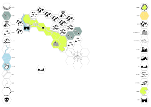

<title>Karta - Gravsådd</title>

# Karta

> Kartan blir vad den blir när spelarna är med och bestämmer. Jag använder Inkscape med ett **axonometriskt rutnät** (spacing Y: 5.5, angle X: 30.0, angle Z: 30.0), **grid snapping** och **Align** satt till **Selection area** för att få hexagonerna att fastna på rätt ställen.
