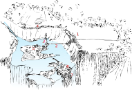

<title>Trame - Gravsådd</title>

# Trame

Staden Trame är belägen på öar i ett floddelta omgivet av branta höjder. Bortom öarna störtar floden, Dåraforsen, i ett mäktigt vattenfall. Man livnär sig på fiske och jordbruk. De större jordbruken är förlagda till höjderna bortom staden men öarna rymmer tillräckligt med åkerplättar för att försörja staden i händelse av belägring. Med sitt tusental innevånare är Trame en koloss i Ravland.

Höjderna runt deltat kantas av befästningsverk uppförda med hjälp av dvärgar från Vigstejn och uppvisar tydliga tecken på att ha formats med stensång. En onaturligt smäcker stenbro förbinder ett lika onaturligt högt och smäckert torn på huvudön med befästningsverket på höjderna.

Under Alderkrigen raserades försvarsverken på några ställen, först av alderländska styrkor och senare av Zyteras horder. Staden har dock aldrig fallit. Man är idag sysselsatt med att försöka återställa verket men saknar kunniga stensångare till de klurigare konstruktionerna då Vigstejns dvärgar är upptagna med sina drömmar om att återinviga Vigstejns ruinband i det dvärgiska kungadömet.

Besökare behöver lejdebevis eller ett giltigt skäl att träffa någon i stadens råd för att släppas in. Möten med mindre namnkunniga bofasta, liksom all handel, förläggs till utsidans brofäste.

### Platser

1. Stora porten. Landsvägen övergår i stenläggning och sluttar sedan nedåt, under och igenom porten. På andra sidan tar bron till huvudön över. Två högre torn ramar in konstruktionen.
2. En mycket smäcker bro formad ur ett enda stycke vit sten leder från Stora porten till Spiran.
3. En vacker spira formad i samma vita sten som bron. Toppen höjer sig över det yttre befästningsverket.
4. Åkrar. En bräsch i befästningsverket har blivit en permanent sluss för jordbrukare. Man hissar materiel och folk mellan toppen och en hamn för pråmar och roddbåtar nere vid vattnet.
5. Arenan.
6. Bassängen. En avlång fiskdamsliknande konstruktion förlagd till vattenfallets rand på den näst största ön. Hem åt najaden Sefyrnea.
7. Mausoleet, beläget på den näst största öns utlöpare mitt i vattenfallet.

Övriga:

* Giriga Korpen. Värdshus beläget längs försvarsverkets utsida nära stora porten. All handel med utsocknes sker i och kring värdshuset eftersom främlingar utan lejdebevis inte släpps in i Trame.

### Stadsråd

* Buximil
* [Herind Gulöga](herind_gulöga.html). Ett av Merigalls barn, Sefyrneas älskare, eländ, magikunnig bard och bortskämd odåga.
* Druiden Amarmara Tramahan, människa. Ogillar Gulöga för dennes relation med Sefyrnea som hon önskar företräda ensam.
* Daras Döderdressare, älvestamling som gift in sig i Tramahans släkt. Sköter allt som rör mausoleerna i Trame. Symbolist. Anser Herind vara en odugling som borde försöka bevisa sitt värde.
* Diverse viktigpettrar ur stadens näringar och försvar.

### Dibromoindigo

Indigo kan framställas från vissa växter och vissa snäckor. Med växterna är det i regel ganska lätt och resultatet blir utmärkt. Med snäckorna är det ett förfärligt krånglande och de är dessutom inte alldeles lätta att få tag på. Släkten Tramahan har gjort nyansen till ett hovprivilegium varför den växtbaserade varan verkligen inte duger och är strängt förbjuden i Trame.

Kort och gott:

* Framställningen av indigo är en alkemisk-helig syssla där nyansen bestäms av mängden solljus under torkningen av infärgade tyger.
* Det färgade tyget stinker initialt av fisk och måste genomgå flera cykler av sköljning och torkning för att betvinga lukten. Den perfekta slutprodukten doftar behagligt av genitalier.
* Stadens grädda bär vackra mantlar av tyget för att markera sin status.

Staden praktiserar religiösa riter där vanligt folk byter till sig helgade indigotyger mot offergåvor (slaktboskap, avsalugrödor, vin och andra jordbruksprodukter) som de "behöver" för att två sina samveten, rena kroppen efter utslag/menstruation eller be om gudarnas hjälp.

Att [Herind](herind_gulöga.html) tillåts frossa i materialet sticker i ögonen på somliga. Särskilt halvlingarna i den religiösa elit som sköter hela offercirkusen har reagerat på att eländen inte ens verkar förstå vilken betydelse indigo har för stadens "sammanhållning".

> *Dibromo* är en kemisk klassificering av molekyler med vissa egenskaper. Ämnen kan ge färgen indigo utan att vara dibromoföreningar men dessa duger alltså inte i Trame.
