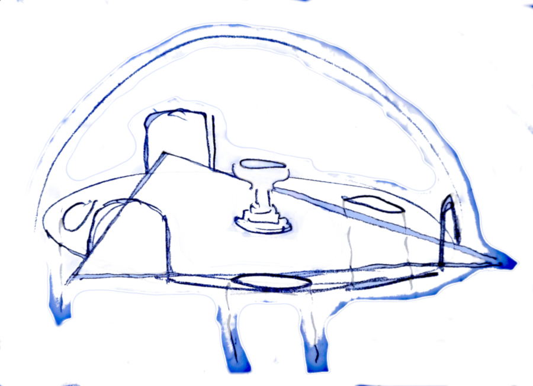

# 19

## Logg

AONRE och O Flemming talar med KROMLACH på värdshuset. Han klagar över att känna sig sliten mellan verkligheter sedan resan genom grisens demoniska inre. Han önskar sig lite hjälp av RPna att besöka sitt gamla konvent norr om Trame. Man kan bara hitta det genom att följa ett vattendrag tillbaka till sin källa, vilket är enkelt gjort för den invigde. Men KROMLACH oroar sig för hur han ska bli bemött efter de förändringar han genomgått. Ett förkläde kunde vara hjälpsamt.

Ale Odalen berättar historien om Trames rening för utsocknes.

Värdshuset observerar utegångsförbud om natten, eller släpper i vart fall inte in nya gäster efter mörkrets inbrott. Nu bultas det dock ändå på av kagiga dvärgar som åberopar Kung GÖFF och kräver en förklaring till varför en dvärgisk stridsrustning tillhörande Bux Bare står lämnad bland hästar och ök bakom huset. Det är Garin och Raffir.

O Flemming och AONRE blir snart indragna i ett samtal med radarparet, utanför. De har till ärende att kräva tillbaka Bux skatt då Buximil inte längre kan anses ha ärvt den sedan Bux återuppstått. Dvärgisk lag...

RPna anser sig veta var skatten befinner sig: I mausoleet. Där finns även Daras Döderdressare, symbolisten av ätten Trame, som RPna fortfarande inte fått att inställa sig för utförande av gravförsegling vid Bux Bares sista viloplats. Eller näst sista...

Så nu då? KROMLACH kan tänka sig att bistå ett nattligt inbrott i mausoleet om det leder till att han får tillgång till hjälp av en annan druid eller häxa. Detta skulle kunna vara en väg i den riktningen; möte med häxor. RPna är villiga att hjälpa till för att få det förbaskade klotet och samtidigt lösa uppdraget om en symbolist.

Återstår Ale Odalen, som ljuger pöbeln full innanför. Raffir kliver in på värdshuset där den gode barden precis avslutar en skröna med "... och det är alltså så man tillverkar mjölk!" Väl extraherad utstår han plågsamma frågor om rustningen och hans allmänna förmåga och vilja att hålla sig till sanningen. Mjölk!?!

Mitt i natten sätter gruppen av söderut längs stadsmurens utsida. Vid stupet som avgränsar Trame från Dåraforsens lägre lopp tar Odalen av för att vänta med maskinen i skogen till öster. Den kan ej klättra nedför stupet. I vart fall vågar man inte testa förmågan. Övriga tar sig runt stadsmuren på hemlig dvärgisk väg och ska sedan våga sig över det vadställe som avgränsar det smalare vattenfallet från avgrunden nedanför. På andra sidan skymtar najadens ö, mausoleet bortom denna.

O Flemming skickas över med ett rep. En mörk, enorm kropp kröker sig i vattenytan. Det är najaden, Sefyrnea, som funnit ett ståtligt riddjur: Trames nyinstallerade storsjöodjur. Hon år inte precis hotfull men hon ställer krav: RPna ska, såsom de nu har ärende i mausoleet, ge henne ett halsband som "är av vattnet" som pryder någon döing men som egentligen är hennes. Ahem, visst... Och de får på inga villkor låta Herind Gulöga vakna... Självklart! Absolut inte!

Gruppen smyger sig förbi Sefyrneas bassäng där gurglande snarkningar hörs. "Min älskare sover alltid i min säng!" Han snarklar vidare, ostörd men tydligtvis lättväckt.

Vakter patrullerar mausoleets utsida men gruppen passerar i en enda tät formation, oupptäckta.

De dödas tempel står öppet. En lång bred korridor leder rakt in och ljus kan anas i ett större rum i byggnadens centrum. Mindre gångar leder från korridoren till stängda rum, flankerade av "statyer" som "avbildar" de vilande döda. (Detta är de vilande döda.) Man gömmer sig tillfälligt i dessas skydd för vakterna som passerar utanför och för en eller flera personer som passerar i den stora salen vid korridorens slut.

Man finner tre ting:

- En guldbroderad mantel i dibromoindigofärgad, rik filt. (AONRE)
- Ett halsband som liksom ormfjäll "rinner" under fingrarna, som vatten. (O Flemming)
- En nästan, men bara nästan, stängd dörr till en av sidokamrarna. Ljus faller ut och en mansröst hörs innanför. Han belastar en okänd person med anklagande liknelser om envisa och otacksamma kvinnor.

Mannen träder ut, drämmer igen dörren, som åter inte riktigt stänger sig (dåliga gångjärn?) och vandrar surmulet mot stora salen, ovetande om gruppen utanför.

Ett försök görs att kommunicera med den snyftande damen innanför men hon blir rädd eller misstänksam. När svar inte ges och varje sekund utanför dörren ökar risken för upptäckt väljer RPna att bara fortsätta istället.

Det centrala rummet är en dom med en manshög font i mitten. Golvet är indelat i fyra sektioner av en triangel inlagd så att varje hörn är placerat i öppningen till någon av de tre korridorer som leder in.

Daras sjunger på sin muntra melodi,

> Tystnad råder, tystnad råder här,
> i min / din misär!

tittar ner i fonten från dess översta trappsteg, upptagen i sin egen värld. Riktar sedan uppmärksamheten / sången mot osynliga eller föreställda personer bortom salen.

RPna bestämmer sig för att storma Daras. Han griper ett av de många symbolkort han bär i rockslaget; En LOCKELSE, och kastar mot AONRE som är först in. Besvärjelsen verkar men snedtänder så att effekten omfattar Daras med. De båda magikerna brottas som barn på en lekplats om det åtrådda kortet, farligt nära en av de djupa brunnar som är inlagda i golvet. (Daras siktade på brunnen för att få sin angripare att slänga sig i den men missade.) Garin och Raffir knockar mannen och iklär honom handbojor.

Vakterna utanför har noterat larmet och frågar på behörigt avstånd om allt står rätt till. De är förbjudna att beträda mausoleets sal. RPna hinner gömma sig i en av de andra korridorerna och vakterna tvekar inför tystnaden. De bestämmer sig för att kalla på förstärkning och lämnar byggnaden.

O Flemming, som gömt sig bland statyerna igen, ser en halvlingskvinna med blont hår i fläta smyga sig ut bakom vakterna. Han sätter efter, upptäcks av vakterna men lyckas till slut fälla damen nära Sefyrneas bassäng. Det är Esusla. Hon försvarar sig vigoröst men inte framgångsrikt och däckas. Herind vaknar av larmet...

O Flemming släpar in sitt byte i ett buskage för att undvika vakterna men hittas. Han manar dem, generöst, att låta honom gå så att ingen behöver dö idag. De hörsammar honom inte. Båda bryts, en med ett otäckt, ymnigt blödande sår i benet. (Ej dödligt, de kommer att vittna senare.)

Dvärgarna stonkar förbi, med Daras i ett bylte, mot vadstället. O Flemming axlar sin fånge och sätter efter.

KROMLACH och AONRE söker efter BÖRRIS klot i mausoleet. AONRE kan inte påminna sig ledtråden om placering i trianglar och använder till slut magisk syn. Eländet ligger i fonten och syns inte från golvet. Utanför har Herind stämt upp i sång och harpospel för att klarna sina dimmiga tankar. Vakterna fördömer sin olycka för de vet vad som väntar. AONRE kämpar mot utgången med sin otympliga börda, till vrålet av döda furstar och furstinnor av Trame som vaknar omkring honom.

Vid vadstället väntar Sefyrnea. Från sitt vidunder accepterar hon smycket, överräckt av O Flemming, men morrar missnöjt över sin älskares musiks väckelsekraft.

Dvärgarna är uppe i varv av mandom och dådkraft, korsar vadet strax. Vakterna vågar sig fram och börjar beskjuta den flyktande gruppen när AONRE gör sin passage. Han träffas och bryts, faller utför fallet till en vattnig grav.

Eller??

O Flemming ber övriga att möta upp nedför floden. Garin beskriver en enkel fiskeby, en dagsresa nedför floden, och fortsätter med övriga till mötet med Ale. KROMLACH får ansvar för häxan Esusla.

Ett fall nedför stupet vore slutgiltigt men tjuven klarar det och finner AONRES kropp uppkastad bland änder på en grästuva i vattnens lugnare östliga sida. (Dåraforsens västra sida sluttar brant ner i mer strömt vatten och befolkas tätt av troll, vilket utgör en definitiv kartgräns...)

AONRES glödpipa räddar de två våtfrusna äventyrarna från en säker död, dess osvikliga förmåga att tända eldar till tack. Från en dunge ekar på torr mark föreställer de sig kaoset i Trame långt ovanför. Inget hörs dock och ingen tycks leta efter dem. Väl torra vandrar de till nästa dags tidiga förmiddag innan de kollapsar av utmattning.

De väcks av barn som trissar varandra att stjäla deras ting. AONRE, som förlorat sitt svärd, rustning och mycket annat till vattnen, ser också otäck ut som få. Tjuvens packning är lättare att vittja.

Deras djupt harmynte ledare är stor nog att inte låta leken gå för långt. Teklenn presenterar sig som "Trollafängets ledare", vilket inte ska tas på för stort allvar. Återbördar sedan O Flemmings minotaurhorn. Deras by är nära och RPna är hans gäster sedan O Flemming roat dem med skryt om sina tillhörigheter.

Trollafänget saknar helt föremål i metall trots att Garin & Raffir (och ibland andra utsända) tittar till det inavlade skithålet med något års mellanrum. De mottar tacksamt några silver (och kommer att ställa till det för sig i framtiden när de försöker sig på handel i Trame). De kan tillverka enkla båtar men håller sig till devisen att inte lämna hemmets härd p.g.a. blodsdimman. De har varit isolerade i generationer.

Resten av sällskapet anländer efter en lång omväg som tillåter färd i Bux rustning. KROMLACH avvek med Esusla, magiskt inkapaciterad av AONRES dämpande halsband. (O Flemming var i besittning av det då han tillfångatog häxan.) KROMLACH såg till att bli sist ned för en besvärlig passage med repklättring, gjorde helt om, och har säkert intressanta problem att navigera nu...

Diskussion uppstår om magiska klot, BÖRRI (dvärgarna har först svårt att tro sina öron) och den nya kunskapen att Kung GÖFF också har ett klotlås. Ty Bux krävde att få det innan han avbröt sin belägring och vandrade runt hela Vigstejn. Han är nog förresten snart framme i Trame... Man får också veta att XAYE fortfarande lever, enarmad, i dvärgisk fångenskap.

Garin & Raffir menar att de egentligen inte behöver Bux *i* graven för att infria sitt löfte om att vårda den, bara Daras, en symbolist av Trames ätt, är villig att sköta sin del i återförseglingen. Dags att höra efter vad mannen har att säga... Barnen på honom med kvistar där han sitter bunden till ett träd. AONRE har stulit hans kortlek och kritor. (Återstår bara en liten hammare och några fina mejslar för stenarbete.)

Daras historia:

- Ogillar Rostbröderna och misstänkte hela tiden att något var falskt med Aalgard Majestäts försök att förena Ormes och Korps folk mot de himmelska makterna.
- Esusla sökte sig till honom för att charma och infiltrera men han mjölkade henne istället. Väntade på tillfälle att exponera rovdriften av liljanseld.
- Menar att inga bevis finns på att någon varit smittad med mogsot på många år, Mamlins påståenden till trots. Så vad gör Rostbröderna med de indigo-offrande allmoge som funnits orena?
- Menar att det är Rostbröder som sköter det mesta av befästandet av de fria jordbruken runt Trame.

Daras låter sig övertalas att det kunde vara riktigt dumt att återvända till Trame just nu p.g.a. Bux armé. Går med på att infria stadens gamla löfte om att delta i dvärgarnas skötsel av Bux grav. Garin & Raffir löser RPna från deras skuld att föra en symbolist till graven. De kan fokusera på "försäkringen" och BÖRRI istället. De, dvärgarna, tillstår, mellan raderna, att RPna listat ut att Dron är en gigantisk eldkatt som sover i ÄSSJAPOTT och att det inte vore första gången hon kallades på för att låta världen brinna. Förloppen som nu satts i rullning måste hindras.

Dvärgarna är fortfarande ganska ointresserade av människornas egna konflikter och rörelser så länge de håller sig på sitt håll. Uppskattar att Mamlin och anhang inte olovligen (d.v.s. aldrig) passerat gränsen till Vigstejn.

BÖRRIS klotlås, upphängt bak Bux vandrande rustning, ruvar hemlighetsfullt. Garin & Raffir har bara hört sägner om dessa artefakter. Finns alltså BÖRRIS "vita" skatt däri sedan XAYE lagt den däri och stängt locket, alla till förtvivlan? O Flemming prövar den kod han själv valde till klotet i BÖRRIS lilla verkstad. Låset öppnar sig. Vad är detta? Kan alla med en kod öppna alla klot? Och hur många finns det? Tre? (Trame, GÖFF och BÖRRIS egna.)

Någon skatt syns inte till, men en helt nyskriven lapp, tecknad med dvärgiska runor:

> Bästa reskamrater. Jag fann för bäst att tidigarelägga min färd till vår mötesplats.
>
> B.

Flemming ber Garin att lämna ett kortfattat svar:

> Uppfattat.
>
> O. F.

AONRE sticker sedan hela huvudet in i det dimfyllda klotet för att syna etervindarna som blåser i Det Stora Bortom. På ren intuitiv kraft finner han sig snart förd till ett eldigt berg höljd i ångor. Ormlika skepnader seglar som skuggor på avstånd. Något eller någon fattar aggressivt intresse och han drar huvudet ur kitteln i ett svavelosande moln, åtföljd av en rytning. Ett fjäll har har han fått med sig i nypan.

> I [logg 21](21.md) har fjället blivit en sköld åt O Flemming men exakt hur AONRE fick detta att hända är förlorat i tidens sand.

O Flemming reder ut hur Nem'Sat'Gors lassostav faktiskt fungerar. Gissar att mörkalven är något slags prisjägare eller indrivare.

RPna bestämmer sig för att söka upp GUBBEN MONS på Stubbasten. En lite omväg run Bux förmodade framryckning mot Trame är ändå nödvändig och de hoppas att åldringen ska ha liljanseld i sin "kista". Alla som varit med ett tag tycks ju sitta på egna lager i händelse av att skulder måste regleras.

Hela gruppen vandrar österut tills dvärgarna och Daras måste ta av åt norr mot graven. RPna gör inga möten i barrskogarna öster om de kullar som avgränsar ekskogen längs Dåraforsen. Man orkar bara inte riktigt pressa vandringen och tvingas slå läger blotta milen från Stubbasten.

En häst utan ryttare dyker upp. (**Slumpmöte #6, furstarna av Lavide.) AONRE har hört talas om rövarna som tagit sig ett fäste och blivit "fint folk".

O Flemming spårar hästens färd tillbaka till en plats för ett förmodat överfall nästa dag. Hittar tecken på orcher (ett radband av kycklingben) och konstaterar att de sannolikt burit sin fånge österut, också i riktning mot Stubbasten. De når Stubbasten utan tillstötning och hälsas efter utbyten om fredslöften välkomna tillbaka.

MONS undrar om XAYE och annat nytt. RPna fiskar efter handel med liljanseld, gubben svarar undvikande att han har sina egna "försäkringar" i kista, etc. Hans barn är utflyttade till Trame och Haggahus och han kunde behöva avlastning för att gå i pension. SLUR och Tidir räknar han mest med att de ska skära halsen av varandra, ställa till på alla sätt, om han inte kan hitta bättre arvingar. RPna börjar misstänka att han är mycket äldre än vad han ser ut att vara. (Är det föryngrande att ta sig en hutt liljanseld ibland?)

Om orcher i skogen: Där är en ny stam som börjat röra sig i området och hamnar i konflikter med den redan etablerade stammen. De är farliga men MONS har kunnat blidka dem med byteshandel och sitter nog säkert på sin stubbe. Furstarna av Lavide har han också mött; uppskattar dem för befolkning om än inget annat. De klagade över att de nya orcherna försöker pressa dem till tjänst i Sorias enade rike...

RPnas frågor om försäkringen och MONS egna historia, XAYE, m.m. leder till att de till slut berättar allt de vet för honom.

*"Så ni ska rädda världen, alltså?"*

Och liljanseld behöver de dessutom? Alla går till kistan. De tre repen hänger kvar, ett med darrningar, precis som innan. De hjälps åt att hala upp detta. I ändan hänger en demonisk kvinna bunden topp till tå, med munkorg.

Det är Krasyllas dotter, enligt vad MONS tror sig veta.
