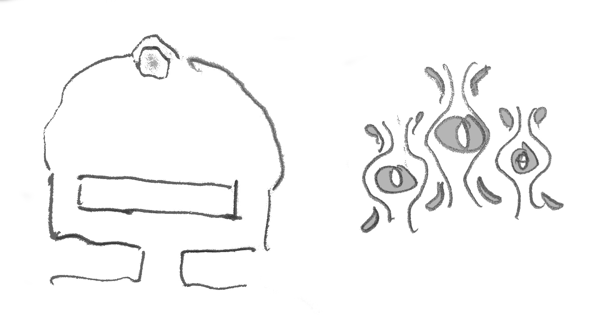

# 21

## Logg

Utkikarna berättar att rostbröderna slagit ett mer beständigt läger (tipi, torkställningar, latrin, etc) och var på väg norrut. Utkikarna hittade hjulspåren och tecken på 15-20 vandrare. Lägret är slaget i närheten av "döda skogen" i en öppen sänka mellan två åsar, invid en bäck.

RPna beslutar att Odalen ska stanna i Lavide för att laga en ny skråma i rustningen, plus O Flemmings feta sköld som bröts i bataljen.

Bargath ämnar inte ge sig av någonstans men Umlia och två "frivilliga" kan övertalas. De leds av en utkik till hjulspåren och följer dem norrut. Aonre, som måste koncentrera sig noga för att inte göra väsen av sig skaffar sig både ryggont och pollenhuvudvärk av strapatsen.

Brödernas befäl och trosschef håller puts och studs medan ferralen, en äldre man i vita kåpor liknandes Mamlins, helar de mer illa åtgångna.

Umlia tecknar åt gruppen att hålla sig tyst och stilla. Detta passar Aonre illa.

Tre bröder skickas uppför åsen för att undersöka. Aonre väntar på dem med tre spelkort LOCKELSE (Daras Döderdressares) och de slänger sig tjutande av iver in i björnbuskar för att nappa dem. Besvikelsen är sedan stor när effekten omedelbart upphör och de dessutom mejas ner bakifrån av O Flemming och Umlia. Aonre klipper påpassligt en av de busksnärjdas händer och träder ut i skogsbrynet på åsen. Han vinkar glatt, till bröderna där nere, med svärd och hand i hand.

Bröderna ställs upp till försvar runt ferralen. Fem spjutbärare bakom fem bågskyttar i halvmåne, plus befälet självt. Ferralen besvärjer de vanväxta hästar som drar deras vagnar att göra sig redo för strid.

Avståndet är precis för stort för DÖDSHAND så O Flemming får lossa första pilen. Han missar precis befälet, som trotsigt håller blicken stadigt på RPna när vinddraget från projektilen rufsar hans hårstubb. "Vänta på skott!" kommer order som svar.

Aonre bestämmer sig för att minska avståndet och springer de tio metrar som krävs, lägger sedan DÖDSHAND mot ferralen samtidigt som befälet brölar att låta pilarna vissla. Besvärjelsen övertänder med missöde (demoniska syner) men det gör också ferralens ANTIMAGI (med samma missöde!)

Ferralen är död, men det är också Aonre. Fyra fina träffar, en mitt i pannan, blir för mycket.

Befälet ryter om motanfall och resten av RPnas grupp lägger benen på ryggen. O Flemming undgår på håret att klösas av den flygande vanväxare som lyckades fly efter gårdagens nederlag och nu har smugit på honom från ovan.

O Flemming flyr över stock och sten tills han helt tappat bort sig. Så hör och ser han Umlia bland träden. Hon försvinner bakom en stenkulle. Han följer efter. Där är en gammal mossbevuxen port huggen i bergsidan. Rovdjur tycks använda den som matsal men där är färska fotspår i böset. Han vågar sig in och finner en liten sal bakom en dubbelkorridor:

Ingen är här men nästan torkat blod lackar ett litet altare längst in. Han vänder ut igen. Skogen är nu markant annorlunda. Det som tycktes grönt är nu dött och sprött av ålder. Ett klicketi-klick av metallspröt hörs. Har han gått igenom en portal? Han går omvänd vän in och ut igen. En tunn röd ånga har börjat formas över blodsoffret, skogen utanför är lika död som nyss.

Metallsprötens dans hörs igen. Skräcken börjar klösa i honom och han tar till flykten. Det sista av kvällssolen ör nog för att ta ut en riktning västerut (mot rostbrödralägret). Han finner en uttorkad man uppbunden i friskare trädgrenar i döda skogens utkant. Full av medömkan skär han ner gubben och bjuder honom vatten. De måste vidare för järndoften av röd dimma blir allt starkare men gubben är för svag för att gå och klagar efter fru och barn som tydligen också finns i närheten.

O Flemming väljer att rädda sig själv...

Det slutgiltiga mörkret lägger sig över Aonres sinne men Nem'Sat'Gor talar till honom. De kan förena sig och leva igen om Aonre bara öppnar sig för alven. De sluter en pakt på det sista av magikerns andedräkt...

RIFEN RÖDNAGEL har skuggat sin oaktsamme kusin sedan Trame. De förföljs av en sprakande rödhårig skönhet i onaturligt hel och ren äventyrardress som också talade helt kort med gruppen utanför Trame. Är hon farlig? Hon tycks ibland medveten om RIFEN men gör inget åt honom. Han börjar känna att kan kanske bara förslösar sin energi och tid när något oväntat inträffar: Aonre skjuts till döds i en glänta och lämnas helt ensam medan rostbröderna jagar resten av gruppen. Han tar sin chans och manar sin varg, Skugge, ut i det öppna. Magikern har månget märkligt på sig att vittja men när han kommer till en skrovlig gammal sten står rödelöparen plötsligt i gläntan och kräver att få den. Hon tystar hans varg enkelt med ett kommando och lyckas, med ansträngning, se igenom hans kappas FÖRVRÄNGA SINNE. De kivas men hon kan också leda RIFEN till O Flemming som hon menar är i fara. Han låter henne leda vägen.

O Flemming rasar nästan i famnen på dem och piper om blodsdimma. Gul'Ullra'Tin är måttligt bekymrad och vill hellre ha svar på frågor om varför gruppen inte hållit sig till de uppdrag Syn'Dhe och Syn'Tikh gett dem. De kommer över ens om att tala igen vid Lavides kvarn nästa dag. Hon marscherar sedan rätt in i döda skogen och försvinner.

Tillbaka hos furstarna blir det mycket snack med för mycket alkohol om framtiden och det förgångna. Gammelgumman känner igen de tre märkliga ögon O Flemming sett ristade över altaret i grottan. Bargath vill hellre byta hembesök på Stubbasten än att bara sälja saker. De förstår att rostbröderna gjort sig immuna mot blodsdimman genom att utsträcka sitt "hem" till allt större områden coh de vill göra samma sak.

Bakrusiga på svampar och dryck möter O Flemming och RIFEN Gul'Ullra'Tin nästa dag. Hon är autistiskt besvärlig men löser dem åtminstone från Synernas uppdrag att leta rätt på Drons avkommor. "Askans plogbill" skulle sova tyngre om de kunde föras hem, vilket förhoppningsvis kunde försena en utlösning av "försäkringen". Ingen har tid att vänta på RPna längre så bara lämna över den där kattkompassen, tack.

RPna fångar henne sedan i ett konsekvenshörn av hennes egen logik och hon ser sig nödd att förklara ett par saker:

- Personer som Bux försöker ibland bräcka "systemet" som de utomvärldsliga utsätter alla för i sin rovdrift. Men det kan inte lyckas då dessa hjältar måste luta sig mot samma system som de försöker förgöra. I bästa fall kan de motarbeta utsugarnas mer handgripliga framfart. Med det förståndet vore det faktiskt inte så dumt att låta Bux få sina mynt.
- Alverna är satta att övervaka systemets korrekta och rättsenliga förvaltning, vilket de inte finner något nöje i. Det låter dem åtminstone förhindra aktiveringen av systemets försäkringar så att vanligt folk inte behöver utraderas tillsammans med allt annat levande i återkommande helveteseldar som bränner Stor bar och kal i hundratals år. Eller kanske längre.
- RPna har tydligen idéer om att ge sig upp för ÄSSJAPOTTS himlatrappa (hon har nu haft ett litet initialt samtal med Nem'Sat'Gor) men då ska de förstå att endast den som tillhör världen kan kapa banden med systemet (d.v.s. dvärgar, halvlingar och kanske orcher men inte människor eller alver). Detta kan bara ske utifrån och personen är sedan förlorad utan en egen världstillhörighet. Den vanligaste utkomsten bland dilettanter som ger sig på sådana försök är att de förbländas av möjligheterna bortom världen och träder ut ur den för att berika sig. Sedan saknar de tillhörigheten som krävs för att kunna klippa banden. De blir själva en del av "systemet".
- Systemets medlemmar och dess domstols förrättare kan förgiftas och undanröjas men ett maktvakuum fylls alltid snart av någon som väntade i kulisserna.
- Nem'Sat'Gor har brutit mot systemets regler coh måste föras inför de utomvärldsligas domstol för att lugna dem vars fingrar vilar på försäkringens avtryckare.
- Hon minns inte namnet "BÖRRI" men vet väl att en del akter RPna tillskriver honom är verklig historia. Hon måste friska upp sitt minne i Vigstejn.

## Vad händer sedan?

De befästa fribönderna runt Trame, alla rostbröder eller allierade med Aalgard Majestät, belägrar Trame. De omringas snart av Bux, vilket leder till dödläge. Aalgardisterna förhandlar och sluter en pakt. Bux installeras som furste av Trame och ett sant terrorvälde inleds, häxorna förföljs, etc. Staden rustar för kamp mot de himmelska helveteshorderna.

Bux söker användning av BÖRRIS klot för att kommunicera med vem nu vara månde är konung i Vigstejn. (Han är invigd.) Blir rasande över att det är borta. Utredningen av stölden pekar entydigt ut de kanaljer som störde hans gravfrid: RPna. Rostbröder sänds ut att hitta klotet. Med sig för de Sångar-Jan att vara behjälplig. (Han lider stort.)

BÖRRIS klotlås är egentligen bara skepnader av samma klot. Den som invigts genom att ha låtits sätta en egen kombination kan därför öppna samtliga. BÖRRI har själv ett men vill helst ha ytterligare ett med sig till Himlatrappan för att kunna skapa en stabil och kontrollerbar kanal mellan Mog och Stor. Denna kunde användas som attackvektor eller som flyktväg för en liten nog varelse, vilket BÖRRI själv knappast är. (Han slås heller inte av den möjligheten.)

Av den långa väntan på RPna blir BÖRRI uttråkad och tar upp brevväxling med klotens enda återstående innehavare: Kung GÖFF. Han är säker på att någon i Trame också använt klotet regelbundet (men känner inte XAYES öde) och lämnar därför bara ett enda meddelande på allmänmål till RPna, om de skulle få fatt i klotet. (Att de redan lyckats vet han inget om.) För övrigt skriver han endast med dvärgiska runor, på antagandet att en obehörig kunnig läsare måste vara dvärg och därför är oantastligt lojal med Vigstejn. (Han är själv undantaget som bekräftar regeln...) Alltså: Det otydbara meddelandet som RPna hittade under [besöket på Stubbasten](21.md) var inte till dem...

Kung GÖFF nås av bud från Garin & Raffir att de plikttroget är vid att stänga Bux grav. Därtill att den nådige konungen kanske kunde låta sig bekymras av att en gammal legendarisk skurk tycks ha återuppstått, gett RPna en gåva ursprungligen ämnad åt Bux, plus uppdrag därtill: Att bärga ett sådant där klot som de officiellt inte känner till att även GÖFF har... Detta är nog för att GÖFF ska öppna klotet, under beskydd av hovets präster, siare och magiker.

Stängningen av Bux grav lyckas till slut, med komplikationen av orchiskt försök till ärovinst. En död angripare blir kvar i den stängda graven och kommer att gå igen. Helgedomen kommer att frekventeras av orchiska pilgrimer och dödsmagiker.

Daras, som inte kan återvända till ett belägrat Trame, söker asyl i Vigstejn. Berättar om RPna och klotet.

KROMLACH utvecklar en synnerligen obehaglig taktik för överfall och rånmord m.h.a. sina hundar som nu blivit intelligenta som chimpanser.

Esusla kan heller inte återvända till Trame. Aalgard Majestät, visst, men hon är också häxa och därför jagad. Hon sluter ett passivt partnerskap med KROMLACH i väntan på tillfälle att avvika. Förhalar löftet att hjälpa den demoniske druiden då hon inte är trygg med flera av de tänkbara utgångarna.

Dämmerkloss Hammare - Bargaths långa dvärgiska stridshammare. Uppkallad efter den dvärgiska sägnen om riskerna som följer med stor makt. Bestämmaren som förlorade respekt och stod ensam vid slutet.

Orcherna gör sig påminda. De har drabbats av en svart sot...

Dvärgiska artefaktjägare säker Konungens Klot... Och annat människor inte ska ha. På Stubbasten t.ex.

BÖRRI lämnar ett meddelande på Aldermål i klotet (som för tillfället är kvar på Stubbasten) att RPna till varje pris måste för det med sig till deras mötesplats.

Vägfarare (orcher?) bringar bud om att Trame belägrats av stadens fribönder. De resande fick alltså vända i ogjort ärende. Sedan sprang de nästan i famnen på Bux. (SLUR är med Bux än men saknar XAYES beskydd.)

Kung GÖFF har blivit påmind om Stubbastens existens genom kontakten med BÖRRI, som skapade Stubbasten.

Tidir dyker upp med sin fina sköld (Syskonen Syns gåva) och förklarar att de måste återvända till Stubbasten. Där är dvärgar som vill in för att konfiskera saker. De lät sig bara övertalas att vänta lite för att hon kunde visa på något som faktiskt givits av Vigstejn, och då kan de ju inte bara anta att allt dvärgiskt de ser är orättfärdigt vunnet (klotet, gamla vapen, hela Stubbasten faktiskt).
