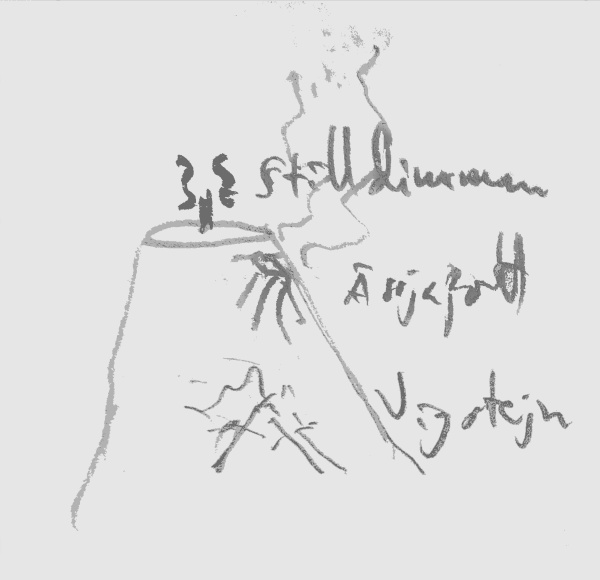

# 24

## Logg

Väktarsyskonen är tveksamma till att släppa in dessa okända besökare; dvärgen i sällskapet vill det inte ens. BÖRRI för RPna åt sidan utanför muren, menar att han inte sätter sin fot igen i Stilldimman - för mycket grönt, för lite sten! - utan tänker stanna och viska med eldkatterna. Han vill ha RIFENS kattvissla (som svartalfen ändå inte borde ha). Vidare har han en plan: När RPna fört låsklotet inför den där domstolen i Mog ska de öppna det så att BÖRRI kan ge dem en rejäl dos från vulkanen. Enkelt" Med mynten dessutom ska de lära demonpacket en oförglömlig läxa!

RIFEN byter till sig BÖRRIS oldmormors fickplunta i stål och en skäggring (att trä över armen) och så ärd et adjö, BÖRRI.

Alverna nöjer sig alltså inte med Mamlins betygelser, även som de väl känner och välkomnar henne. Vad med RPna? Ale menar, med Nem'Sat'Gors skuldeliggare i nyporna, att de kommit Krasyllas skatt av Liljanseld på spåren. De kan hjälpa till att lösa den urgamla skuldetvisten. Alverna får lov att dofta lite på en dekanterad flaska av stridsmaskinens bränsle, konstaterar att årgången tycks stämma, och släpper in RPna.

Särskilt den förmörkade av alverna, Syn'Lei'Gor, är villig att ta RPnas parti och förebrår den ljusare brodern för brist på perspektiv. Han har ju aldrig lämnat världen. Mörkalven utser sig själv till ledsagare och så bär det av.

Stilldimman är markant kallare än området vid vulkanen precis utanför. Det är som att gå in i ett kylrum. Växtligheten täcker precis allt på marken och är frostig av kyla. Syn'Lei'Gor varnar dem att de ska hushålla med sin proviant eftersom alverna inte odlar någon ätlig gröda. Liljanseld är allt de behöver, men det kan andra släkten inte tåla att konsumera, i vart fall inte utan lång träning.

Det är sen natt nu och RPna är utmattade. Syn'Lei'Gor bjuder dem att slå läger i en rosenlund där ett maffigt stenbord placerats - en gammal gåva från någon fåfäng dvärgakung som ingen riktigt minns. Buskarna ska de passa sig för. Blombladen ger brännskador men kan också bryggas till ett feberbrytande te. Sägs det... Alver blir själva inte sjuka men RIFEN kan gott plocka åt sig lite om han vill. Det gör han så klart.

Alla lägger sig för att sova, utom Lei som vakar över dem. När de vaknar är det fortfarande natt, trots att de alla sovit länge nog. Vad nu?! Lei menar att solen aldrig höjer sig över Stilldimman. Själv uppskattar han arbetet som gränsvakt just för att det låter honom njuta av himlakroppens skönhet. Där de befinner sig nu är det inte långt att gå om de vill se den. En lite avstickare har de säkert tid till.

Vid klinten som vetter mot världen utanför svindlar perspektivet. Världen är konformad? Solen står lågt över horisonten i väster, ty det är morgon i Vigstejn, men horisonten själv står i 80 graders lutning!

Där finns tre himlatrappor ut i Ravland, Blodslandet och Bittermarken. På en fjärde sida finns ett stort hav som avskiljer Ravland från det vidsträckta Dragarike som gränsar till Blodslandet. I söder bortom Ravland ska Alderland finnas, och sedan är där inte mycket mer. I diskussionerna runt denna överraskande världsordning framkommer det att Lei, och kanske alla alver, anser att alla mer nordliga släkten åtnjuter en koncentrerad karaktärsstyrka som så att säga följer naturligt av världens koniska form. Ett slags rasbiologisk sanning som är så självklar att den inte ens behöver undersökas. Följdaktigen bor bara människorna - boskapen - i söder medan de äkta släktena alla är hemmahörande i norr.

Det är förvisso oklart varför Mog introducerade människorna via havet, men det kanske var lättare så. Människorna själva tror att de utvandrat från ett mytomspunnet land i öst, med det är självklart nonsens. Om de kom från Dragarike hade de väl precis lika gärna bara ha kunnat vandra österut över land istället?

Man går vidare. Från Leis beskrivningar tycks det att Stilldimman är tre eller fyra mil lång och något smalare. Han redogör för delarna i sitt eget namn: *Syn* för syskon och *Gor* för den som lämnat världen men återkommit. Syskonskap är speciellt för att det ovanligt och minner om de fem systrar som den Röde Löparen, stjärnan, först kastade från himlen. Han delar alltså sten med sin bror, men det är på inget sätt tydligt vad det egentligen innebär.

De kommer till en vilolund där trädgårdsmästare vårdar tusen och åter tusen alvrubiner som sitter infattade i de låga träden. Det hela påminner om en apelsinodling. Lei är mycket noggrann om vikten av att respektera de sovande fränderna genom att inte tala och för övrigt inte göra annat väsen heller.

Tyvärr, tyvärr, kan O FLEMMING inte lägga band på sig utan måste fram och pilla, ser något fantastiskt i en av rubinerna och undslipper ett "Wow!"

Leis stress är total. De måste omedelbart igenom och ut på andra sidan. Väl där redogör han för att inget förtroende kan ges halvlingen att passera lunden igen. Ty en gång är varje gång! Beklagligt nog betyder det att O FLEMMING kommer att få lämna Stilldimman via någon av de andra två himlatrapporna, när det väl är dags. För övrigt tycks snedsteget inte ha några sociala konsekvenser alls, vilket är en smula absurt, men kanske hittar halvlingen fler sätt att göra bort sig. Sådant kan man ju inte veta på förhand.

En rödelöpare passerar, på väg ut ur Stilldimman. Budskapet: Mog har stängt Fröbaljan! (Tornet)

Man skyndar vidare. Vid tornet i mitten av Stilldimman samlas alver på behörigt avstånd. Några mer seniora typer i rober går runt och talar med de som anländer. Tornet är i tegel, kanske 20 meter högt, och innesluts i toppen av det ljusfenomen man kunnat se på håll under vandringen. Ljusets form påminner om en frökapsel, eller ett öga med ögonlock ställt på högkant. Tydligen, enligt äldstemodern, All'Ejda eller Bidrottningen, har en representant för Mog anlänt, deklarerat gränsen stängd och dragit igen dörren. Ingen kommer in och ett stort antal röda knivliknande kreatur sysselsätter sig med att bygga ut något slags golv eller balustrad runt tornets topp, vilket ser ut att skärma av ljusfenomenet.

Allmodern är upprörd. Sådana här tilltag medges inte av det fördrag man har med utomvärldslingarna. Inte går det att registrera en formell protest heller ty domstolen finns i världen bortom och representanten på plats är inte hörsam.

Tornets dörr är inlagd med koncentriska metallringar med invändiga kuggar. En grund amfiteaterliknande mekanisk anordning som tydligen är dörrens nyckelhål. Den påminner om klotlåsens förslutningsring.

En gång hade man en nyckelväktare - Mif'Kif'Tah - som satt i tornets topp med sin kosmiska kikare och väntade på Drejarens, och de andra gudarnas, återkomst. Tegelfars utkik, Drejarens båtvakt, etc, (många namn har hen) ledsnade vid något tillfälle under Alderkrigen eftersom Mogs fria passage gjorde hans arbete tämligen överflödigt. Tog alltså nyckel och kikare och drog till skogs. Dörren fick helt enkelt stå på vid gavel tills vidare. Nu behövs nyckeln om någon ska kunna komma in. Och eventuellt är det bråttom ty Mogs ambassadör yrade om nöden att skydda världen på andra sidan mot försäkringens förestående utlösning. Varför nu det är nödvändigt.

Vid tidigare återställningar har Horns flammor aldrig nått in över Stilldimman coh total skövling har det ändå heller aldrig varit tal om. Alverna tar det alltså roligt såtillvida, men det är besvärande att deras egna utgårdafränder på andra sidan nu är fast där.

Ale överväger att hoppa med rustningen mot tornets topp men tvekar. Når han verkligen? Så var är nyckelväktaren då? Stilldimman är ju inte stor. Ingen vet, och förklaringen är besynnerlig:

Då väktaren svikit sitt ansvar har han straffats hårt på så sätt att han nekas hågkomst. Skulle någon stöta på honom så ser upptäckaren till att glömma det. Och skulle det misslyckas så är det inte tillåtet att erkänna några minnen eftersom det skulle störa andras ansvar att glömma brottslingen. Han kan vara lite var stans alltså, utan att någon kan veta det. Men då han själv sökte ensamhet verkar det osannolikt att han skulle kampera nära himlatrapporna. Och de bästa platserna att himlaskåda är i vart fall bara tre: Fröbaljan, de ofantligt höga träden mellan Blodslandet coh Bittermarken, samt det flacka landskapet vid klinten mot havet.

RPna, varma i hjältebrallorna, (förutom O FLEMMING som ifrågasätter att något alls behöver hända här för Mog har väl gjort dem alla en tjänst genom att stänga om sig?) erbjuder sig på studs och ställe att leta upp och tala sans med Gudarnas Nattvakt!

(Och någonstans i allt detta lyckas Mamlin få RPna att ge henne 2 poäng Liljanseld så att hon kan återställa sig. Hon klarar tydligen av att dricka sörjan och yngras synbart.)

## Vad händer sedan?

All'Ejda visar sig ha en köttbiodling.

Kalm'Fell'Rod föreslår att man försöker påminna sig om var Stanengist lags undan då kronan kunde vara användbar nu. Den behövs förstås också för att proppa igen portalen i Vond, men ändå.

Zertorme och en hord Aslener kräver passage genom Vigstejn för att nå den vaknande guden Horn.

Mif'Kif'Tah är bitter och våldsbenägen. Med sina kunskaper i illusionism gör han gisslandramer till frukost och halstrar äventyrare till lunch.

BÖRRI har bedragit dem alla. Han tänker visst inte klå upp Mogerna utan ämnar lämna världen så snart RPna öppnar klotlåset i Mog. Syns det inte rätt tydligt att han är en *Gor*?

Miff drabbas av gudomlig inspiration när det ser som mörkast ut.
